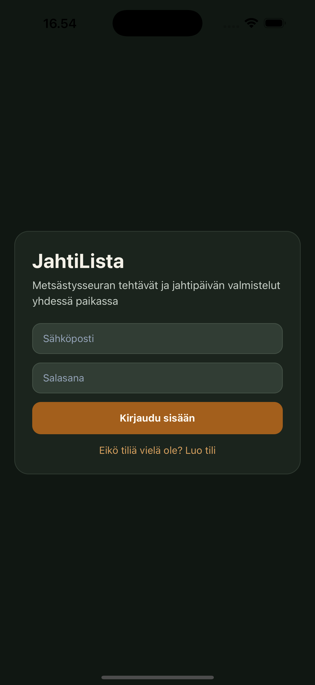
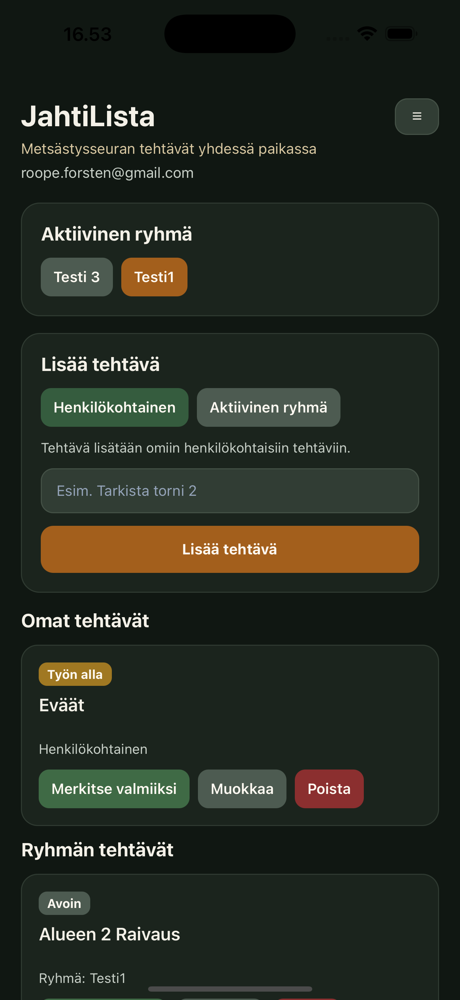
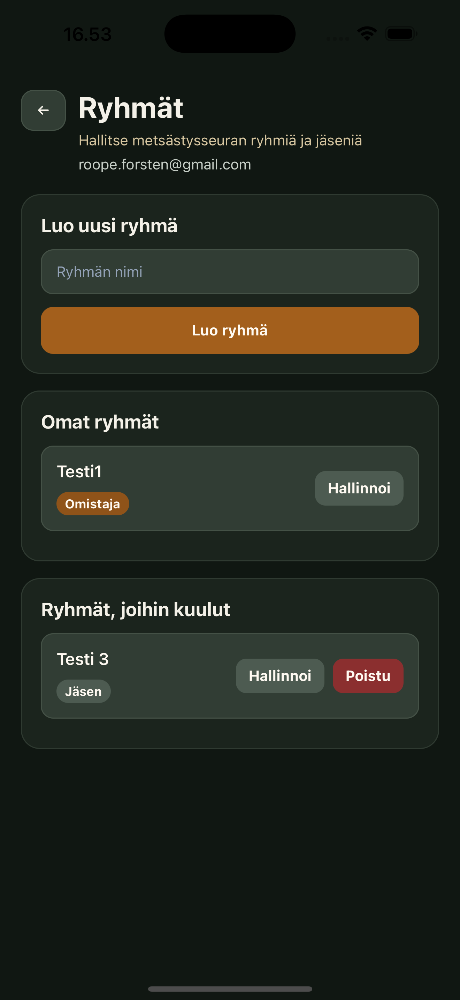

# JahtiLista

JahtiLista on Expo Router + Supabase -pohjainen tehtäväsovellus, joka on suunnattu metsästysseurojen ja jahtipäivän valmisteluiden hallintaan.

Sovellus toteutettiin ennakkotehtävänä TODO-appin vaatimusten pohjalta. Halusin tuoda tehtävään mukaan henkilökohtaisen näkökulman, joten valitsin käyttökontekstiksi metsästysseurat. Tällä tavalla perinteinen todo-sovellus sai käytännöllisemmän käyttötarkoituksen: tehtäviä voidaan hallita sekä henkilökohtaisesti että ryhmänä, mikä sopii hyvin metsästysseuroille jahtipäivän valmisteluihin.

Sovellus toimii sekä mobiilissa (Expo / iOS Simulator) että webissä.

## Demo

Testaa sovellusta täällä:  
[https://eralista.vercel.app/]

## Miksi tämä näkökulma valittiin

Valitsin metsästysseura-kontekstin, koska halusin tehdä tehtävästä persoonallisemman mutta silti tehtävänannon mukaisen. Perinteinen todo-sovellus on teknisesti toimiva, mutta metsästysseuran käyttöön suunnattu ratkaisu toi mukaan aidon käyttötapauksen:

- tehtäviä voidaan tehdä yksin tai yhdessä
- ryhmän jäsenet näkevät yhteiset tehtävät
- tehtäviä voidaan ottaa itselle työn alle
- valmiit tehtävät erottuvat omaksi kokonaisuudekseen

Näin sovellus ei jäänyt vain CRUD-harjoitukseksi, vaan siitä muodostui pieni monikäyttäjäsovellus todelliseen käyttökontekstiin.

## Teknologiat

- Expo / Expo Router
- React Native
- TypeScript
- Supabase Auth
- Supabase Database
- Supabase Row Level Security
- Expo Web
- iOS Simulator -testaus

## Ominaisuudet

### 1. Kirjautuminen ja rekisteröityminen

Sovelluksessa käyttäjä voi:

- luoda tilin sähköpostilla ja salasanalla
- kirjautua sisään
- saada virheilmoituksen, jos tiedot ovat väärin tai kentät ovat tyhjiä

Tämä toteutettiin Supabase Authilla, koska se täytti tehtävänannon vaatimukset suoraan ja piti toteutuksen kevyenä.

### 2. Henkilökohtaiset tehtävät

Käyttäjä voi lisätä henkilökohtaisia tehtäviä, jotka näkyvät vain hänelle.

Tämä ratkaistiin niin, että tehtävä voidaan luoda ilman ryhmää. Näin käyttäjä voi käyttää sovellusta myös täysin henkilökohtaisena tehtävälistana.

### 3. Ryhmätehtävät

Käyttäjä voi kuulua ryhmiin ja lisätä tehtäviä valittuun aktiiviseen ryhmään.

Ryhmän jäsenet näkevät saman ryhmän tehtävät. Tämä valinta tehtiin, jotta sovellus tukee yhteistä organisointia esimerkiksi ennen jahtia.

### 4. Tehtävän valinta itselle

Ryhmän avoin tehtävä voidaan ottaa omalle vastuulle valitsemalla se.

Kun tehtävä valitaan:

- sen status muuttuu työn alle
- tehtävään tallentuu käyttäjä, joka tekee tehtävää

Tämä ratkaisu tehtiin, jotta ryhmän yhteiset tehtävät eivät jää epämääräisiksi, vaan näkyy selvästi kuka tekee mitä.

### 5. Valmiit tehtävät erillään

Valmiit tehtävät näytetään omassa osiossaan.

Tämä parantaa käytettävyyttä, koska aktiiviset tehtävät ja valmiit tehtävät eivät sekoitu samaan listaan.

### 6. Ryhmien hallinta

Sovelluksessa voi:

- luoda ryhmän
- lisätä ryhmään jäseniä sähköpostilla
- poistaa jäseniä
- poistua ryhmästä
- poistaa koko ryhmän, jos on sen omistaja

Ryhmien hallinta toteutettiin kevyesti ilman raskasta admin-paneelia, jotta kokonaisuus pysyy selkeänä mutta silti monikäyttäjäisenä.

### 7. Virheiden käsittely ja käyttöliittymä

Sovelluksessa huomioitiin:

- tyhjät syötteet
- väärät kirjautumistiedot
- lataustilat
- toimintonäppäinten estäminen latauksen aikana
- selkeä ja mobiiliin sopiva käyttöliittymä

Visuaalisesti sovellus suunniteltiin tummalla ja jahtihenkisellä värimaailmalla, jotta käyttöliittymä tukee valittua käyttökontekstia.

## Arkkitehtuuri lyhyesti

Sovellus käyttää Supabasea sekä autentikointiin että tietokantaan.

Keskeiset taulut:

- `profiles`
- `groups`
- `group_members`
- `tasks`

Tehtävillä on mahdollisuus olla:

- henkilökohtaisia
- ryhmäkohtaisia

Ryhmän tehtävissä voidaan lisäksi tallentaa:

- kuka loi tehtävän
- kuka tekee tehtävää
- mikä on tehtävän tila

## Käynnistys paikallisesti

1. Asenna riippuvuudet:

```bash
npm install

2. Lisää projektin juureen .env-tiedosto:
EXPO_PUBLIC_SUPABASE_URL=
EXPO_PUBLIC_SUPABASE_PUBLISHABLE_KEY=

3. Käynnistä projekti:
npx expo start
	web: w
	iOS: i
```

## Kuvakaappaukset

### Kirjautuminen



### Etusivu



### Ryhmät


